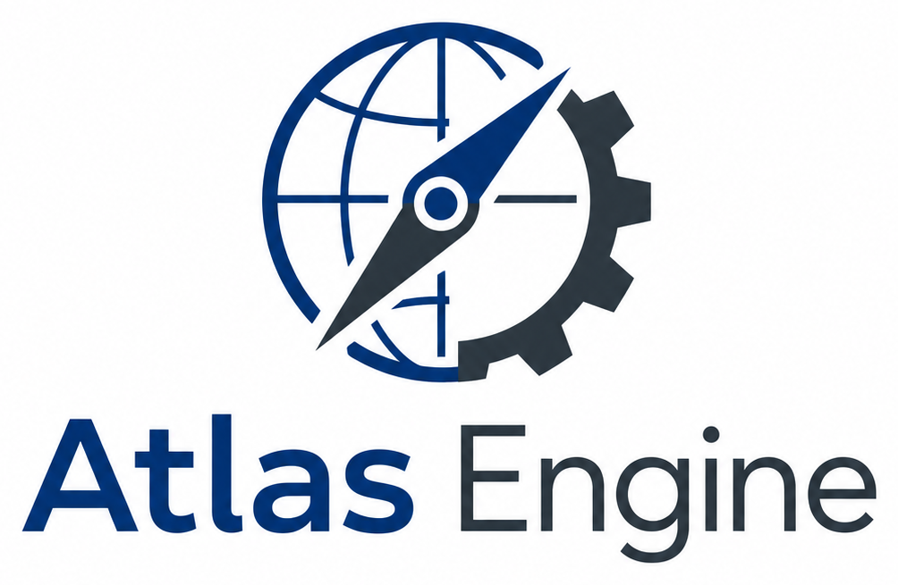

<p align="center">
  
</p>

# Atlas Engine

[](https://doi.org/10.5281/zenodo.22752178)
[](https://github.com/Wontae-Lee/atlas-engine-dev/actions/workflows/tbb.yml)
[](https://github.com/Wontae-Lee/atlas-engine-dev/actions/workflows/python.yml)

Atlas simulates rarefied gas flows using direct simulation Monte Carlo (DSMC).
It provides a C++20 engine and a Python interface for defining particle
populations, materials, geometry, and boundary conditions. Computation runs
on a CPU through TBB or on an NVIDIA GPU through CUDA. Python applications
use the same simulation classes with either engine.

A simulation is assembled from the components needed for the case. Particle
motion can be used on its own, or combined with gas collisions, emission,
surface interactions, and particle removal. Results can be read into NumPy,
processed or saved by the application, or stored as binary state snapshots.

- Hard-sphere, variable hard sphere (VHS), and variable soft sphere (VSS)
  collision models.
- Analytic shapes and OBJ triangle meshes for geometry.
- Configurable particle sources, velocity distributions, boundaries, and sinks.
- Particle positions, velocities, species, and grid state accessible from Python.

## Choose how to run

| Your workflow | Start here |
|---|---|
| Run Python with Atlas and its dependencies in a container | [Docker](#start-with-docker) |
| Use Atlas in your own Python environment | [Local Python installation](#install-python-locally) |
| Build and run a C++ simulation | [C++ example](#run-the-c-example) |

The build examples below use the current source checkout and create local
Docker tags. Published images can be used without building from source.
The Docker route includes the Python environment and runtime
libraries; local installation builds Atlas for an existing Python environment.
The C++ example is a separate executable built from the same engine.

## Prepare the source checkout

The commands in this document start from the repository root. With Git
installed, clone the project and its dependency submodules:

```bash
git clone --recurse-submodules https://github.com/Wontae-Lee/atlas-engine-dev.git
cd atlas-engine-dev
```

If you already have a checkout, run `git submodule update --init --recursive`.
The submodules contain libraries needed during compilation, including the
Python bindings and snapshot serialization dependencies.

## Start with Docker

This route requires Docker on the host. Python, NumPy, and Atlas are installed
inside the image, so a separate host Python environment is not needed.
The initial image build downloads dependencies and compiles Atlas; subsequent
container runs use the installed package.

### CPU

Build the TBB image and run the included Python simulation:

```bash
docker build --target tbb -t atlas:tbb .
docker run --rm atlas:tbb python /opt/atlas/examples/python/dsmc_dense_cell.py
```

The `tbb` target creates a CPU runtime image. No NVIDIA GPU or CUDA toolkit is
needed. The example initializes 200 particles and advances the simulation by
20 steps. It prints the final cell and particle counts, together with the mean
particle speed before and after the run. Its source is
[`examples/python/dsmc_dense_cell.py`](examples/python/dsmc_dense_cell.py).

### NVIDIA GPU

Build the CUDA image and run the same example:

```bash
docker build --target cuda -t atlas:cuda .
docker run --rm --gpus all atlas:cuda python /opt/atlas/examples/python/dsmc_dense_cell.py
```

The host needs a compatible NVIDIA driver and
[NVIDIA Container Toolkit](https://docs.nvidia.com/datacenter/cloud-native/container-toolkit/latest/install-guide.html)
configured for Docker. The image supplies the CUDA runtime. A GPU is required
to run the simulation, but not to build the image.

Both images use Ubuntu 22.04 by default. Add
`--build-arg UBUNTU_VERSION=24.04` to build with Ubuntu 24.04.
For example:

```bash
docker build --target tbb --build-arg UBUNTU_VERSION=24.04 -t atlas:tbb-ubuntu24.04 .
```

Each image contains its selected Atlas engine and uses it automatically.
Select the corresponding image when running a script.

### Run your own script

Save your script as `simulation.py` in the current directory:

```bash
docker run --rm -v "$PWD":/workspace atlas:tbb python simulation.py
```

For CUDA, add `--gpus all` and change the image to `atlas:cuda`.
The mount makes the current host directory available at `/workspace`, which
is also the container's working directory. A relative path such as
`results/positions.npy` therefore writes into the host's `results` directory.
These files remain after the container exits. Files saved elsewhere in a
container started with `--rm` are removed with that container.

Changes to mounted scripts and input files are visible on the next run without
rebuilding the image. Changes to Atlas itself require an image rebuild.
The bundled examples are under `/opt/atlas/examples/python`, and mesh assets
are under `/opt/atlas/assets`.

For an interactive Python session:

```bash
docker run --rm -it atlas:tbb
docker run --rm -it --gpus all atlas:cuda
```

See the [Docker guide](docs/guidelines/docker.md) for GPU architecture options,
image contents, and development containers.

### Using a published image

After the images have been published to GitHub Container Registry, a
`linux/amd64` host can run them without a source checkout:

```bash
docker run --rm ghcr.io/wontae-lee/atlas-engine-dev:tbb-ubuntu22.04 python /opt/atlas/examples/python/dsmc_dense_cell.py
docker run --rm --gpus all ghcr.io/wontae-lee/atlas-engine-dev:cuda-ubuntu24.04 python /opt/atlas/examples/python/dsmc_dense_cell.py
```

Each engine has Ubuntu 22.04 and 24.04 tags. The package must be public for
anonymous access. Image tags and version selection are described in the
[Docker guide](docs/guidelines/docker.md#published-images).

## Install Python locally

Local installation compiles the Python package from the checkout. The commands
below use Ubuntu 22.04 or 24.04 and install the host compiler, TBB development
libraries, Python headers, and build tools.

### CPU installation

```bash
sudo apt-get update
sudo apt-get install -y build-essential cmake ninja-build git libtbb-dev python3-dev python3-venv
python3 -m venv .venv
source .venv/bin/activate
python -m pip install --upgrade pip
python -m pip install . -C cmake.define.ATLAS_DEVICE_SYSTEM=TBB
```

This builds the CPU package from the checkout and installs NumPy with it.
The distribution name is `atlas-engine`; Python imports it as `atlas`.
Build dependencies are downloaded during installation. The source build uses
the system TBB runtime installed with `libtbb-dev`.

The virtual environment keeps the installation separate from system Python.
In a new terminal, return to the checkout and run `source .venv/bin/activate`
before using the package. In an IDE, select `.venv/bin/python` as the interpreter.

Check that the installed classes can be imported, then run the DSMC example:

```bash
python -c "import atlas; from atlas import Float3; print(atlas.__version__, atlas.get_default_engine(), Float3(1, 2, 3))"
python examples/python/dsmc_dense_cell.py
```

### CUDA installation

CUDA installation uses the same host dependencies, plus a compatible CUDA
12.x toolkit with `nvcc` available. Running the resulting package also needs a
compatible NVIDIA driver and GPU. From an activated Python environment:

```bash
python -m pip install . -C cmake.define.ATLAS_DEVICE_SYSTEM=CUDA
ATLAS_DEFAULT_ENGINE=cuda python examples/python/dsmc_dense_cell.py
```

Source installation builds the selected engine. When building for a different
GPU, pass `-C cmake.define.CMAKE_CUDA_ARCHITECTURES=89`, replacing `89` with
your target architecture. Without an explicit setting, the build detects the
local GPU or defaults to `89-real` when no GPU is detected.

### Installing a wheel

A wheel contains a compiled Python package. If you already have a wheel that
matches your platform and Python version, install it in the active environment
by passing its path:

```bash
python -m pip install /path/to/atlas_engine-version-platform.whl
```

Replace the example path with the actual wheel filename. A wheel produced by
the project's packaging script bundles runtime libraries; a wheel built
directly from source can still depend on system libraries such as TBB.

Wheel compatibility and combined TBB/CUDA packages are described in the
[Python guide](docs/guidelines/python.md).

## Choose the Python engine

To choose explicitly, select an installed engine before importing Atlas classes:

```python
import atlas

print(atlas.available_engines())
atlas.set_default_engine("tbb")
print(atlas.get_default_engine())

from atlas import Float3, Fluid, System, Universe
```

Use `"cuda"` for a CUDA installation. You can also select the engine when
starting a script:

```bash
ATLAS_DEFAULT_ENGINE=tbb python simulation.py
ATLAS_DEFAULT_ENGINE=cuda python simulation.py
```

`available_engines()` lists installed engines, not detected GPUs. With both
engines installed, TBB is the default; a CUDA-only installation defaults to
CUDA. An explicit selection must name an installed engine. The environment
variable chooses the initial default, and `set_default_engine()` can change
it before Atlas classes are imported.

| Installation | Available engines |
|---|---|
| TBB Docker image or TBB source installation | `tbb` |
| CUDA Docker image or CUDA source installation | `cuda` |
| Combined CUDA wheel produced by the packaging script | `tbb`, `cuda` |

The TBB and CUDA distributions share the package name `atlas-engine`.
Installing two separate wheels does not combine their engines; use a combined
wheel if both are needed in one Python environment.

Once an Atlas class or computational submodule is imported, start a new
process to change engines. In a notebook, this means restarting the kernel
and selecting the engine before importing classes again. Already-created
objects keep the engine with which they were constructed.

## Your first Python simulation

This example introduces particle creation, the spatial grid, and the time loop.
It moves one particle at a constant velocity, with no gas collision solver or
boundary interactions configured. Save it as `simulation.py` and run it with
`python simulation.py` or the Docker command above:

```python
import numpy as np
from atlas import Float3, Fluid, System, Universe

positions = np.array([[0.25, 0.5, 0.5]], dtype=np.float32)
velocities = np.array([[1.0, 0.0, 0.0]], dtype=np.float32)

simulation = System(
    fluid=Fluid.from_arrays(positions, velocities),
    universe=Universe(Float3(0), Float3(1), cell_size=0.5),
    dt=0.01,
)

for _ in range(10):
    simulation.update()

print(simulation.step)
print(simulation.fluid.positions())
```

The objects in this example have separate roles:

| Object or argument | Role |
|---|---|
| `Float3` | A three-component value. `Float3(0)` sets all components to zero. |
| `Fluid.from_arrays(...)` | Creates particles from matching position and velocity arrays. |
| `Universe(...)` | Defines the grid bounds and cell size used for spatial indexing and per-cell state. |
| `System(...)` | Holds the simulation state and the selected solver and boundary components. |
| `dt` | The time increment applied by each `update()` call. |

After ten steps, `simulation.step` is `10` and the particle's position is
approximately `[0.35, 0.5, 0.5]`. The x displacement is the velocity `1.0`
multiplied by ten time increments of `0.01`. Small differences in the printed
decimal representation are expected from floating-point arithmetic.

The `Universe` bounds define a grid; they do not create reflecting walls or
automatically remove particles. A case that needs those behaviors supplies
colliders or sinks when constructing the `System`.

### Adding gas collisions

The complete [DSMC example](examples/python/dsmc_dense_cell.py) adds molecular
properties and a `DsmcSolver`. It can be run directly after installation:

```bash
python examples/python/dsmc_dense_cell.py
```

The example defines a nitrogen material in a `MaterialDictionary`, initializes
positions and velocities with NumPy, and attaches the materials to the fluid.
It uses a statistical weight of `1e18`, which specifies the number of physical
particles represented by each simulated particle. `DsmcSolver()` selects the
VHS collision model by default.

The source file keeps the particle count, initial distribution, material
properties, grid size, and time increment together so they can be inspected
and changed for a case. Its values illustrate package usage. CPU and GPU runs
use the same API, but parallel floating-point calculations need not give
identical numerical results.

## Working with particle data

Input positions and velocities must be convertible to NumPy `float32` arrays
with shape `(N, 3)`: each row is a particle and each column is an x, y, or z
component. Both arrays must contain the same number of particles. The binding
accepts strided and compatible numeric arrays and converts them at the language
boundary. Use `np.ascontiguousarray(values, dtype=np.float32)` when preparing
the storage explicitly is useful to the calling code.

`Fluid.from_arrays()` allocates capacity for the initial particles by default.
If the simulation will emit additional particles, provide a larger
`buffer_size` when creating the fluid. `particle_count` is the number currently
active; `buffer_size` is the capacity available to the simulation.

Classes use PascalCase names, such as `Fluid`, `Sphere`, `Molecule`, and
`System`. Their methods use names such as `from_arrays()` and `update()`.

`System` takes ownership of its `Fluid` and `Universe`. Read and update their
state through the system after construction rather than reusing the original
objects. Read-back arrays are independent copies in host memory, including
when the simulation runs on CUDA. To change live particle data, modify a copy
and upload it explicitly:

```python
positions = simulation.fluid.positions()
positions[:, 1] += 0.1
simulation.fluid.set_state("position", positions)
```

`simulation.fluid.positions()` and `simulation.fluid.velocities()` return the
active particles as `(N, 3)` arrays. `simulation.fluid.species()` returns the
corresponding species indices. Grid properties and state are available through
`simulation.universe`, and `simulation.searcher` refers to the spatial searcher
owned by the system. Fluid properties are not duplicated on `System`, and
Universe properties remain on `Universe`. A read-back reflects the time of the
call; it does not change as later simulation steps run.

### Saving results

NumPy output is useful for plotting or analysis in a separate script. The
following code continues from the `simulation` created above:

```python
from pathlib import Path

results = Path("results")
results.mkdir(exist_ok=True)
np.save(results / "positions.npy", simulation.fluid.positions())
np.save(results / "velocities.npy", simulation.fluid.velocities())
```

For a binary snapshot of the fluid and grid state:

```python
simulation.save("snapshots")
```

At step 10, this creates `snapshots/time_step_10/fluid.bin` and
`snapshots/time_step_10/universe.bin`. `Fluid.load(path)` and
`Universe.load(path)` accept strings or `pathlib.Path` values and reconstruct
the saved state. To run it again, assemble a new `System` with the desired time
increment, solver, sources, and boundary conditions. These settings and the
previous system's step counter are not restored by loading the state files.

Applications choose when and how to analyze or export these arrays. Simulation
steps do not write files automatically.

## Run the C++ example

The C++ cylinder example sets up a nitrogen flow around an OBJ mesh, with
particle emission, DSMC collisions, surface interactions, outflow removal,
and timing output. It provides a larger example of assembling a simulation.

Use the local build dependencies listed above. From the checkout, build it
with GCC/G++:

```bash
cmake --preset tbb-gcc-release -DATLAS_EXAMPLES=ON
cmake --build build/tbb-gcc-release --target atlas_example_cylinder
./build/tbb-gcc-release/examples/cpp/atlas_example_cylinder 200 assets
```

The executable accepts two positional arguments:

| Argument | Value in the command | Meaning |
|---|---|---|
| Steps | `200` | Number of simulation updates to run. |
| Assets directory | `assets` | Directory containing `cylinder.obj`. |

Paths in this command are relative to the repository root. The example prints
the configured flow regime and wall-clock timings.

For GPU execution:

```bash
cmake --preset cuda-release -DATLAS_EXAMPLES=ON
cmake --build build/cuda-release --target atlas_example_cylinder
./build/cuda-release/examples/cpp/atlas_example_cylinder 200 assets
```

Building requires the CUDA toolkit; running requires an NVIDIA GPU. The
provided presets need CMake 3.21+ and Ninja. They keep CPU and GPU build
directories separate, so both executables can be kept in the same checkout.

See the [example source](examples/cpp/cylinder/main.cu) to customize the flow,
materials, and boundaries. C++ classes are in the `atlas::` namespace and can
be included through `<atlas/atlas.h>`.

## Learn more

- [Python API and state access](docs/guidelines/python.md)
- [Docker images and GPU configuration](docs/guidelines/docker.md)
- [Simulation modules](docs/atlas/)
- [Contributor documentation](docs/guidelines/README.md)
- [Report a problem](https://github.com/Wontae-Lee/atlas-engine-dev/issues)

## Citation and license

If you use Atlas in research, cite the version used for your results.
[CITATION.cff](CITATION.cff) contains the citation metadata for version 0.1.0:
[doi:10.5281/zenodo.22752179](https://doi.org/10.5281/zenodo.22752179).
The [concept DOI](https://doi.org/10.5281/zenodo.22752178) covers all releases.

Atlas is licensed under [GPL-3.0-or-later](LICENSE).
